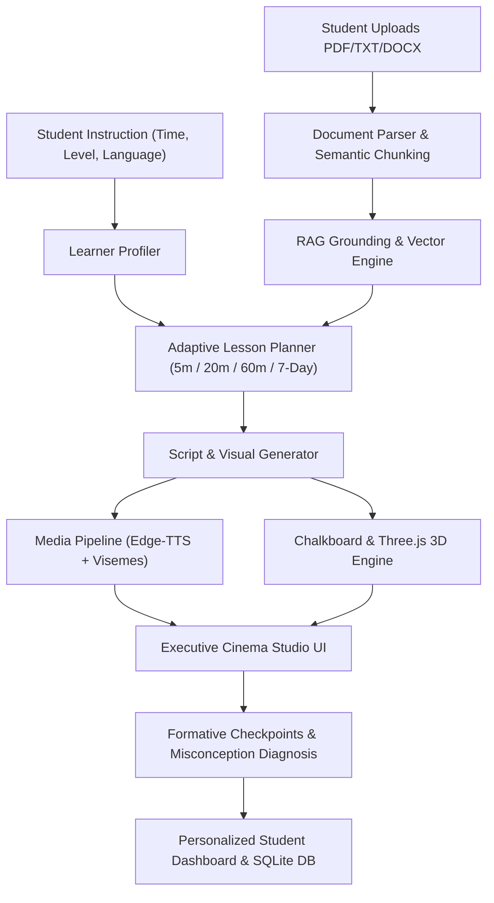

# 🎓 AI Teacher — Autonomous Adaptive Multimodal Educator

[](https://nextjs.org/)
[](https://fastapi.tiangolo.com/)
[](https://python.org/)
[](https://threejs.org/)
[](https://github.com/rany2/edge-tts)
[](LICENSE)

> **"An adaptive AI Teacher that teaches, demonstrates, questions, and diagnoses — not a passive text chatbot."**

AI Teacher is an end-to-end autonomous pedagogical platform designed to transform any uploaded textbook, syllabus, or learning material (PDF, TXT, DOCX) into an engaging, human-like teaching experience. Built with **FastAPI**, **Next.js 14 App Router**, **Three.js WebGL physics simulations**, **RAG grounding**, and **Microsoft Edge Neural Speech**, it adapts dynamically to the learner's available time budget (5 min, 20 min, 60 min, 7-day roadmap), level, and language (English, Hindi, Hinglish).

---

## 🌟 Key Highlights & Innovations

### 1. 🎬 Executive Cinema Studio (8-Col Stage + 4-Col Console)
- **8-Column Cinematic Stage**: Displays high-fidelity 8K educational video renders, interactive Three.js 3D physics sandboxes, and concept flow diagrams.
- **4-Column Studio Console**: Houses the AI Teacher Avatar, voice controls, and the multi-tab interactive learning console (**⚡ Study Suite**, **🗺️ Curriculum**, and **📜 Provenance**).

### 2. 🎥 8K Ultra Cinema & Hands-On 3D WebGL Lab
- **Tab 1 — 8K Ultra Cinema Video**: Photorealistic high-resolution visual model with 60 FPS kinetic vector canvas, interactive timeline scrubber, playback speed controls (0.75x to 2.0x), and timecode tracking.
- **Tab 2 — Interactive 3D Physics Lab**: Real-time Three.js WebGL physics simulation with interactive parameter sliders (velocity, central mass, attention heads, friction) and 360° camera orbit controls.

### 3. 🎙️ Human-Like Avatar & Multilingual Neural Voice
- **Multiple Personalities**: Switch mid-lesson between **Dr. Arya** (Foundations & Intuition), **Vikram Sir** (Exam Specialist & JEE/NEET Tricks), and **Prof. Walter** (Visual Lab Scientist).
- **Trilingual Speech**: Native support for **English**, **Hindi (हिंदी)**, and natural Indian **Hinglish**.
- **Photo-Faithful Avatar**: Clean, steady picture-to-picture presentation with animated speech visemes, natural eye-blinking cycles, and dynamic audio spectrum telemetry.
- **Resilient Fallback**: Automatic failover to W3C Browser SpeechSynthesis if network connectivity fluctuates.

### 4. ⚡ Comprehensive Study Suite
- **🃏 3D Active Recall Flashcards**: Interactive 3D flip cards with self-assessment confidence ratings (Easy, Good, Hard) for spaced-repetition mastery.
- **📑 High-Yield Exam Cram Sheet**: Essential formulas with SI units, common exam trap alerts tagged by severity (Critical / High), and step-by-step solved numericals.
- **🏆 10-Question Master Quiz**: Adaptive multiple-choice quiz grounded in the lesson content with instant feedback, explanations, and score card.
- **💬 Live Q&A Assistant**: In-class drawer allowing students to ask follow-up questions; answers are grounded in textbook citations and verbally explained by the AI Teacher.
- **⏱️ 5m vs 20m vs 60m Comparison**: Observable structural adaptation demonstrating how the lesson dynamically scales concepts and cognitive load.
- **📹 Server-Side MP4 Export**: Generates and downloads an animated tutorial video for offline revision.

### 5. 🗓️ Content-Grounded 7-Day Curriculum Roadmap
- Generates a complete 7-day structured syllabus directly from the student's uploaded document or chosen topic.
- Provides daily milestones, focus descriptions, ~30 mins daily pacing, and diagnostic checkpoints.

### 6. 📊 Real-Time Student Dashboard
- 100% synchronized with the user's uploaded material, real checkpoint scores, and completed concepts.
- Tracks active curriculum track progress, prerequisite modules, and historical mastery.

---

## 🏗️ System Architecture



---

## 🛠️ Technology Stack

| Layer | Technologies |
| :--- | :--- |
| **Frontend** | Next.js 14 (App Router), React 18, TypeScript, Tailwind CSS, Three.js, Lucide React, Canvas API |
| **Backend** | FastAPI, Python 3.10+, Uvicorn, Pydantic, SQLite3, asyncio |
| **AI & RAG** | Google Gemini 1.5 Flash (with resilient offline local fallback engine), TF-IDF Semantic Vector Engine |
| **Audio & Media** | Microsoft Edge Neural TTS (`edge-tts`), ImageIO-FFmpeg, W3C Web Speech API |
| **Persistence** | SQLite (`learner_profiles.db`), Firebase Firestore backup adapter |

---

## 🚀 Getting Started

### Prerequisites
- **Node.js**: v18.0 or higher
- **Python**: v3.10 or higher
- **Git**

### 1. Clone the Repository
```bash
git clone https://github.com/Amritkumarsah/AI_teaching.git
cd AI_teaching
```

### 2. Backend Setup
```bash
cd backend

# Create virtual environment (optional but recommended)
python -m venv venv
source venv/bin/activate  # On Windows: venv\Scripts\activate

# Install dependencies
pip install -r requirements.txt

# Start the FastAPI server
uvicorn main:app --reload --port 8000
```
*Backend API will be running at:* `http://localhost:8000`  
*Interactive Swagger Docs:* `http://localhost:8000/docs`

### 3. Frontend Setup
```bash
# In a new terminal window:
cd frontend

# Install dependencies
npm install

# Start Next.js development server
npm run dev
```
*Frontend application will be accessible at:* `http://localhost:3000`

---

## 📡 Core API Endpoints

| Method | Endpoint | Description |
| :--- | :--- | :--- |
| `POST` | `/api/upload` | Ingests and indexes educational documents (PDF, TXT, DOCX) into RAG |
| `POST` | `/api/parse-instruction` | Extracts student's learning goal, time budget, language, and level |
| `POST` | `/api/plan-lesson` | Generates a time-aware, multi-concept lesson plan grounded in source material |
| `POST` | `/api/get-node-content` | Retrieves concept explanation, spoken script, visual cues, and checkpoint questions |
| `POST` | `/api/synthesize-speech` | Generates multilingual neural audio with viseme phoneme timestamps |
| `POST` | `/api/evaluate-answer` | Evaluates student answers, identifies conceptual traps, and awards scores |
| `POST` | `/api/ask-followup` | In-lesson Q&A grounded in document citations with verbal voice output |
| `POST` | `/api/render-video` | Compiles server-side MP4 educational summary videos |
| `GET` | `/api/flashcards` | Returns active recall 3D flashcards with paradoxes & edge cases |
| `GET` | `/api/exam-cheat-sheet` | Returns high-yield formula cheat sheet, exam traps & solved problems |
| `POST` | `/api/generate-quiz` | Generates a comprehensive 10-question adaptive assessment |
| `GET` | `/api/comparison-plans` | Returns comparative 5-min, 20-min, and 60-min structured lesson plans |
| `GET` | `/api/learning-path` | Generates multi-module dependency roadmap for any domain or document |
| `GET` | `/api/learner-profile` | Retrieves persistent student learning profile and performance analytics |

---

## 👥 AI Teacher Personas

1. **Dr. Arya (Foundations & Intuition)**:
   - Voice: `en-IN-NeerjaNeural` / `hi-IN-SwaraNeural`
   - Pedagogical Style: Warm, encouraging, real-world analogies, step-by-step clarity.
2. **Vikram Sir (Exam Specialist & Problem Solver)**:
   - Voice: `en-IN-PrabhatNeural` / `hi-IN-MadhurNeural`
   - Pedagogical Style: High-yield exam shortcuts, numerical traps, board / JEE / NEET focus.
3. **Prof. Walter (Visual Lab Scientist)**:
   - Voice: `en-US-GuyNeural` / `hi-IN-MadhurNeural`
   - Pedagogical Style: Thought experiments, parameter exploration, formal mathematical rigor.

---

## 📜 License

This project is licensed under the **MIT License** — feel free to use, modify, and distribute for educational and hackathon purposes.
